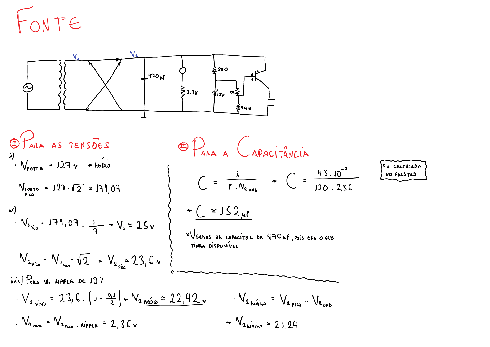
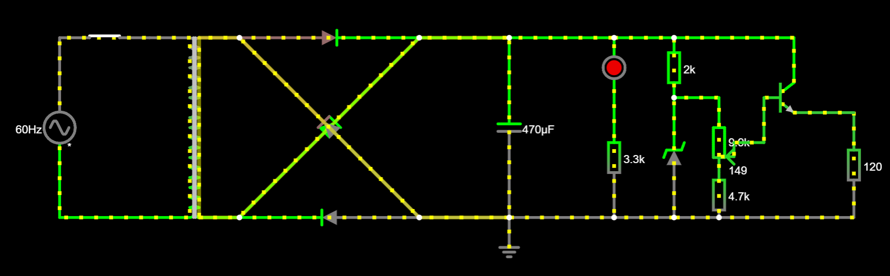
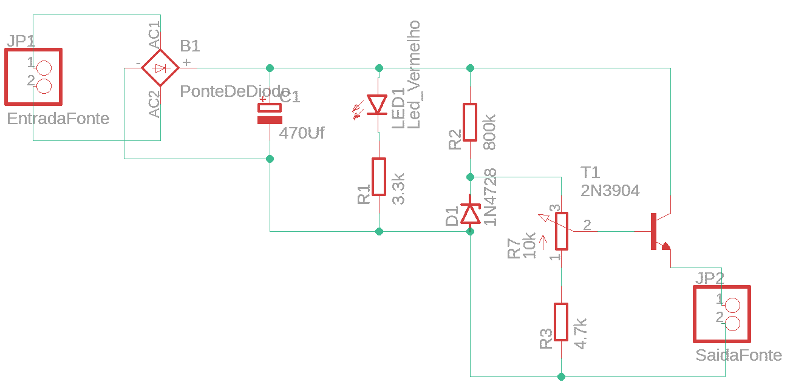
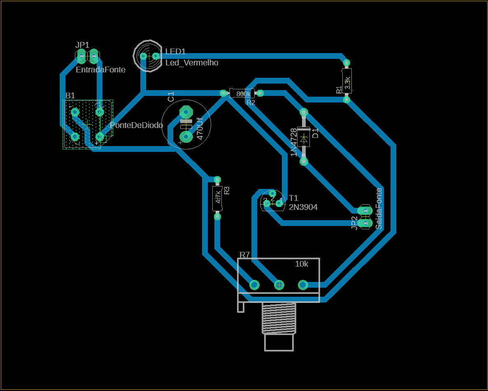

# Fonte de Tensão Ajustável (3V-12V) - SSC0180

## Objetivo
Montar uma Fonte com tensão ajustável entre 3V a 12V com capacidade de 100mA

O projeto foi feito durante a disciplina de Eletrônica para Computação na USP - São Carlos

## Cálculos da Fonte

## Componentes
### Transformador
Componente que modifica a tensão que entra no circuito, transformando a voltagem de entrada em níveis mais compatíveis com as necessidades do circuito. No projeto, foi utilizado um transformador de 127V para aproximadamente 25V.
	
### Ponte de Diodos
Um componente retificador de corrente, a  ponte permite que o circuito seja alimentado por ambos os sentidos da corrente alternada, por meio da conversão da metade negativa do ciclo da onda em tensão positiva.

### Capacitor
Componente utilizado para reduzir a variação da tensão, ou seja, diminuir o ripple. A corrente cedida pelo capacitor alimenta o circuito quando a tensão diminui e o transformador reabastece o capacitor quando a tensão volta a aumentar.

### Diodo Zener
Esse componente permite a passagem de corrente em um único sentido a partir de determinado valor de tensão, e, quando esse valor é atingido, a tensão máxima entre os terminais do diodo  fica constante. Por isso, o diodo zener é um regulador de tensão, que define a tensão máxima do circuito ajustando aquela que sai do capacitor para um valor abaixo do ripple.

### Potenciômetro
Um componente de resistência regulável, ele permite o ajuste da corrente dissipada pelo circuito para que seja possível controlar a tensão fornecida pela fonte em um certo intervalo de valores.

### Transistor
Componente responsável por direcionar a corrente até a saída, sem passar pelo diodo zener, ainda que aproveite a tensão fornecida por esse componente. Isso permite que o valor da corrente na saída atenda às especificações da fonte.

## Preços
| Quantidade | Componente | Valor Unitário | Valor Total|
|--------------|------------|-------|--------|
| 01 | Protoboard 400P | 21,70 | 21,70 |
| 01 | Potenciômetro 10K | 4,50 | 4,50 |
| 01 | Capacitor 470μF 63V | 3,46 | 3,46 |
| 01 | Ponte Retificadora 2A 1000V | 1,87 | 1,87 |
| 01 | Led 5mm Vermelho | 0,40 | 0,40 |
| 10 | Transistor NPN BC-337 | 0,62 | 6,20 | 
| 01 | Diodo Zenner 13V 1W | 0,50 | 0,50 |
| 50 | Resistor 4K7 | 0,08 | 4,00 |
| 50 | Resistor 3K3 | 0,08 | 4,00 |  
| 50 | Resistor 680R | 0,08 | 4,00 |
|**Total:** | | | **50,63** |

_*Os Componentes foram comprados na Pinhé_

## Circuito no Falstad:

Link para Simulação: https://tinyurl.com/2fwxy7yx

## Esquemátido no EAGLE

## PCB no EAGLE

## Fotos do Protoboard

## Vídeo mostrando o projeto
https://www.youtube.com/watch?v=Ix5kuk5UYww

## Integrantes do Grupo:
Felipe Cerri - 15451119

Natalie Coelho - 15481332

Nicolas Maia - 15481857

Vitor Veiga - 15492449
