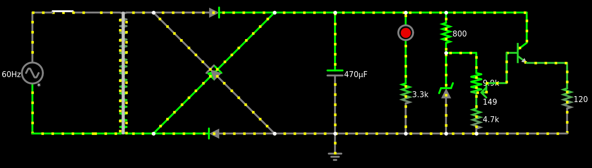

# Fonte de Tensão Ajustável (3V-12V) - SSC0180

## Cálculos da Fonte

## Lista de Componentes
| Quantidade | Componente | Valor Unitário | Valor Total|
|--------------|------------|-------|--------|
| 01 | Protoboard 400P | 21,70 | 21,70 |
| 01 | Potenciômetro 10K | 4,50 | 4,50 |
| 01 | Capacitor 470μF 63V | 3,46 | 3,46 |
| 01 | Ponte Retificadora 2A 1000V | 1,87 | 1,87 |
| 01 | Led 5mm Vermelho | 0,40 | 0,40 |
| 10 | Transistor NPN BC-337 | 0,62 | 6,20 | 
| 01 | Diodo Zenner 13V 1W | 0,50 | 0,50 |
| 50 | Resistor 4K7 | 0,08 | 4,00 |
| 50 | Resistor 3K3 | 0,08 | 4,00 |  
| 50 | Resistor 680R | 0,08 | 4,00 |
|**Total:** | | | **50,63** |

## Circuito no Falstad:

Link para Simulação: https://tinyurl.com/2bf3h89p

## Esquemátido no EAGLE

## PCB no EAGLE

## Fotos do Protoboard

## Vídeo mostrando o projeto
https://youtu.be/0L9eRKaqJ-0

## Integrantes do Grupo:
Felipe Cerri - 15451119

Natalie Coelho - 15481332

Nicolas Maia - 15481857

Vitor Veiga - 15492449
