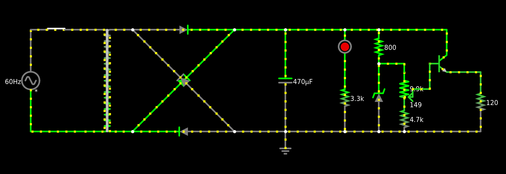

# Fonte de Tensão Ajustável (3V-12V) - SSC0180

## Objetivo
Montar uma Fonte com tensão ajustável entre 3V a 12V com capacidade de 100mA

O projeto foi feito durante a disciplina de Eletrônica para Computação na USP - São Carlos

## Cálculos da Fonte

## Componentes

## Preços
| Quantidade | Componente | Valor Unitário | Valor Total|
|--------------|------------|-------|--------|
| 01 | Protoboard 400P | 21,70 | 21,70 |
| 01 | Potenciômetro 10K | 4,50 | 4,50 |
| 01 | Capacitor 470μF 63V | 3,46 | 3,46 |
| 01 | Ponte Retificadora 2A 1000V | 1,87 | 1,87 |
| 01 | Led 5mm Vermelho | 0,40 | 0,40 |
| 10 | Transistor NPN BC-337 | 0,62 | 6,20 | 
| 01 | Diodo Zenner 13V 1W | 0,50 | 0,50 |
| 50 | Resistor 4K7 | 0,08 | 4,00 |
| 50 | Resistor 3K3 | 0,08 | 4,00 |  
| 50 | Resistor 680R | 0,08 | 4,00 |
|**Total:** | | | **50,63** |
_*Os Componentes foram comprados na Pinhé_

## Circuito no Falstad:

Link para Simulação: https://tinyurl.com/2bf3h89p

## Esquemátido no EAGLE

## PCB no EAGLE

## Fotos do Protoboard

## Vídeo mostrando o projeto
https://youtu.be/rXFI7M6IArU

## Integrantes do Grupo:
Felipe Cerri - 15451119

Natalie Coelho - 15481332

Nicolas Maia - 15481857

Vitor Veiga - 15492449
